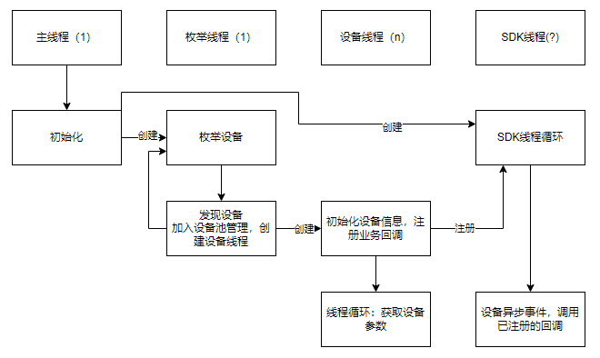

### 1、编译方法

pybind 需要使用 cmake/g++(需支持 C++11) 编译，面向的 python 版本为 python3+，因此，机器上需先安装相关工具链和 python3

```shell
sudo apt-get install python cmake g++ -y
```

安装依赖:
```shell
sudo apt-get update
sudo apt-get install libusb-1.0-0-dev libusb-dev libyaml-cpp-dev libyaml-dev libyaml-cpp0.6 gcc g++ make libopencv-dev libjsoncpp-dev libeigen3-dev libjpeg-turbo8-dev python3-sympy
```

选择任意目录，clone pybind 仓库:

```
 git clone https://github.com/pybind/pybind11
```

构建 pybind:

```shell
mkdir -p pybind11/build
cd pybind11/build
cmake ../
make check -j8 # 执行环境检查
sudo make install # 安装pybind11
```

选择任意目录，clone sdk 仓库:

```shell
git clone https://github.com/SENSING-Technology/sdk-falcon-camera.git
```

构建:

```shell
mkdir -p sdk-falcon-camera/build
cd  sdk-falcon-camera/build
cmake ../
make -j8
```

编译完成后，您将在 build 目录下看到模块文件:

```shell
falcon_sdk.cpython-${PY_VER}${PLATFORM}.so
```

该文件可以被 python3 导入使用。请保证面向的 Python 版本一致，建议参考本文档自行构建，或者我们提供构建脚本

生成 stub：

1. 安装 mypy 模块
   `sudo apt install mypy`
2. 在 build 目录下执行 stubgen 命令，生成 falcon_sdk 的 pyi
   `stubgen --module falcon_sdk`

3. falcon_sdk.pyi 和对应的 so 文件应当一起发布、使用，后续接口文档不再维护，用户直接参考 pyi 即可

### 2、使用方法

#### 2.1 SDK 工作框架



如图，SDK 的主要工作过程为:

1. 初始化
   - 初始化 log 路径和大小，启动 SDK
2. 创建枚举线程
   - 一般来说也可以在主线程中枚举，但在主线程枚举后，用户业务需要在其他线程处理
   * 枚举线程主要任务为发现设备，并管理设备，同时创建设备线程，执行设备有关的初始化
3. 设备线程注册业务回调以获取设备有关信息，该回调函数是在 SDK 线程中调用的

对于 C/C++ SDK，用户可以定制回调函数以进行数据管理。对于 Python SDK，由于存在 GIL 问题，不能在 SDK 线程中调用用户的 Python 代码，因此 Python SDK 封装代码自己注册了若干业务回调函数，并将回调函数中获取的数据，在主线程中，以指定的格式返回

为了方便用户使用，Python SDK 不会完全占用用户的主线程（Python interpreter 所在线程），用户可以调用指定函数获取数据，详见后文的接口说明

#### 2.2. 接口说明

请参考接口说明文档

### 3、示例

请参考 build/demo.py
安装 sympy：
```
pip install sympy
```
测试时，请进入 build 目录执行：
```Python
python3 demo.py
```

### 4、API 文档生成指南

使用 Sphinx 生成 HTML 文档，文档内容由 pybind/falcon_sdk.py 的内容确定。

```bash
cd doc_py
make singlehtml
```

该命令会在 doc_py/build/singlehtml 目录下生成相关文件，用浏览器打开 index.html 即可查看文档，可以使用浏览器的打印功能将文档保存为 PDF

_注意：如果需要自动生成 PDF 文档，请联系我们_

### 5、Python API 测试

1. 我们提供了测试需要的 requirements.txt，以及环境设置的脚本，用户可以在 scripts 目录下执行 setup.sh 以设置环境。一般来说，如果这个脚本执行成功，您就不需要手动执行前面那些命令

```bash
cd scripts
# 因为需要从 GitHub clone，此步骤可能会失败，需要多试几次
./setup.sh
```

2. 执行 build_and_test 会自动执行测试

```bash
cd scripts
# 如果构建失败，这个脚本会自动退出
./build_and_test.sh
```

3. sdk 的 build 目录下可以看到 report.json

```bash
# if you are in scripts, cd .. first
cd build
cat report.json
```

report.json 中您可以看到测试结果，其中包含了执行了哪些测试用例、是否通过、执行了多久等等。当某个测试用例失败时，这些信息对于复现问题十分重要。
关于 report.json 的示例使用，可以参考 scripts/analyze_report.py

示例报告：

```json
{
  "report": {
    "environment": {
      "Python": "3.10.12",
      "Platform": "Linux-6.2.0-36-generic-x86_64-with-glibc2.35"
    },
    "tests": [
      {
        "name": "falcon_test.py::test_create_nvpfm",
        "duration": 0.0033766180276870728,
        "run_index": 0,
        "setup": {
          "name": "setup",
          "duration": 0.0014090620097704232,
          "outcome": "passed"
        },
        "call": {
          "name": "call",
          "duration": 0.0004988090076949447,
          "outcome": "passed"
        },
        "teardown": {
          "name": "teardown",
          "duration": 5.968500045128167e-5,
          "outcome": "passed"
        },
        "outcome": "passed"
      },
      {
        "name": "falcon_test.py::test_init_and_start",
        "duration": 0.0025959160120692104,
        "run_index": 1,
        "setup": {
          "name": "setup",
          "duration": 0.00011029400047846138,
          "outcome": "passed"
        },
        "call": {
          "name": "call",
          "duration": 0.002320044004591182,
          "outcome": "passed"
        },
        "teardown": {
          "name": "teardown",
          "duration": 5.5284006521105766e-5,
          "outcome": "passed"
        },
        "outcome": "passed"
      },
      {
        "name": "falcon_test.py::test_get_device_info",
        "duration": 1.004115057992749,
        "run_index": 2,
        "setup": {
          "name": "setup",
          "duration": 9.822798892855644e-5,
          "outcome": "passed"
        },
        "call": {
          "name": "call",
          "duration": 1.0038092129980214,
          "outcome": "passed"
        },
        "teardown": {
          "name": "teardown",
          "duration": 0.00010938901687040925,
          "outcome": "passed"
        },
        "outcome": "passed"
      },
      {
        "name": "falcon_test.py::test_toggle_state",
        "duration": 0.0007083209929987788,
        "run_index": 3,
        "setup": {
          "name": "setup",
          "duration": 0.00016015800065360963,
          "outcome": "passed"
        },
        "call": {
          "name": "call",
          "duration": 0.00032351299887523055,
          "outcome": "passed"
        },
        "teardown": {
          "name": "teardown",
          "duration": 6.4491992816329e-5,
          "outcome": "passed"
        },
        "outcome": "passed"
      },
      {
        "name": "falcon_test.py::test_stop_nvpfm",
        "duration": 2.523401523940265,
        "run_index": 4,
        "setup": {
          "name": "setup",
          "duration": 0.00016198097728192806,
          "outcome": "passed"
        },
        "call": {
          "name": "call",
          "duration": 2.523002818983514,
          "outcome": "passed"
        },
        "teardown": {
          "name": "teardown",
          "duration": 7.474300218746066e-5,
          "outcome": "passed"
        },
        "outcome": "passed"
      },
      {
        "name": "falcon_test.py::test_recreate_and_stop",
        "duration": 3.5319704289431684,
        "run_index": 5,
        "setup": {
          "name": "setup",
          "duration": 0.00011862698011100292,
          "outcome": "passed"
        },
        "call": {
          "name": "call",
          "duration": 3.53165550599806,
          "outcome": "passed"
        },
        "teardown": {
          "name": "teardown",
          "duration": 7.766898488625884e-5,
          "outcome": "passed"
        },
        "outcome": "passed"
      },
      {
        "name": "falcon_test.py::TestNvpfmData::test_read_imu",
        "duration": 0.7658315000298899,
        "run_index": 6,
        "setup": {
          "name": "setup",
          "duration": 0.003021028998773545,
          "outcome": "passed"
        },
        "call": {
          "name": "call",
          "duration": 0.7595525350188836,
          "outcome": "passed"
        },
        "teardown": {
          "name": "teardown",
          "duration": 0.00023690701345913112,
          "outcome": "passed"
        },
        "outcome": "passed"
      },
      {
        "name": "falcon_test.py::TestNvpfmData::test_read_left_ir",
        "duration": 0.021984909020829946,
        "run_index": 7,
        "setup": {
          "name": "setup",
          "duration": 0.0003525300126057118,
          "outcome": "passed"
        },
        "call": {
          "name": "call",
          "duration": 0.02107437199447304,
          "outcome": "passed"
        },
        "teardown": {
          "name": "teardown",
          "duration": 0.00020547700114548206,
          "outcome": "passed"
        },
        "outcome": "passed"
      },
      {
        "name": "falcon_test.py::TestNvpfmData::test_read_rgb",
        "duration": 0.033080736990086734,
        "run_index": 8,
        "setup": {
          "name": "setup",
          "duration": 0.0002923319989349693,
          "outcome": "passed"
        },
        "call": {
          "name": "call",
          "duration": 0.03226335998624563,
          "outcome": "passed"
        },
        "teardown": {
          "name": "teardown",
          "duration": 0.0002327130059711635,
          "outcome": "passed"
        },
        "outcome": "passed"
      },
      {
        "name": "falcon_test.py::TestNvpfmData::test_read_right_ir",
        "duration": 0.011753763974411413,
        "run_index": 9,
        "setup": {
          "name": "setup",
          "duration": 0.0003085409989580512,
          "outcome": "passed"
        },
        "call": {
          "name": "call",
          "duration": 0.010903588990913704,
          "outcome": "passed"
        },
        "teardown": {
          "name": "teardown",
          "duration": 0.00023309298558160663,
          "outcome": "passed"
        },
        "outcome": "passed"
      },
      {
        "name": "falcon_test.py::TestNvpfmData::test_read_depth",
        "duration": 0.03284933796385303,
        "run_index": 10,
        "setup": {
          "name": "setup",
          "duration": 0.0003033219836652279,
          "outcome": "passed"
        },
        "call": {
          "name": "call",
          "duration": 0.03199766200850718,
          "outcome": "passed"
        },
        "teardown": {
          "name": "teardown",
          "duration": 0.0002450319880153984,
          "outcome": "passed"
        },
        "outcome": "passed"
      },
      {
        "name": "falcon_test.py::TestNvpfmData::test_read_depth_pseudo",
        "duration": 0.03265337995253503,
        "run_index": 11,
        "setup": {
          "name": "setup",
          "duration": 0.0003158399777021259,
          "outcome": "passed"
        },
        "call": {
          "name": "call",
          "duration": 0.03177189899724908,
          "outcome": "passed"
        },
        "teardown": {
          "name": "teardown",
          "duration": 0.0002498009998816997,
          "outcome": "passed"
        },
        "outcome": "passed"
      },
      {
        "name": "falcon_test.py::TestNvpfmData::test_disable_imu",
        "duration": 3.003238755016355,
        "run_index": 12,
        "setup": {
          "name": "setup",
          "duration": 0.000324330001603812,
          "outcome": "passed"
        },
        "call": {
          "name": "call",
          "duration": 3.002353262010729,
          "outcome": "passed"
        },
        "teardown": {
          "name": "teardown",
          "duration": 0.00023683300241827965,
          "outcome": "passed"
        },
        "outcome": "passed"
      },
      {
        "name": "falcon_test.py::TestNvpfmData::test_disable_depth",
        "duration": 3.0032188030018006,
        "run_index": 13,
        "setup": {
          "name": "setup",
          "duration": 0.00030181699548847973,
          "outcome": "passed"
        },
        "call": {
          "name": "call",
          "duration": 3.002227032004157,
          "outcome": "passed"
        },
        "teardown": {
          "name": "teardown",
          "duration": 0.0003881370066665113,
          "outcome": "passed"
        },
        "outcome": "passed"
      },
      {
        "name": "falcon_test.py::TestNvpfmData::test_disable_depth_pseudo",
        "duration": 3.002403808030067,
        "run_index": 14,
        "setup": {
          "name": "setup",
          "duration": 0.0005855080089531839,
          "outcome": "passed"
        },
        "call": {
          "name": "call",
          "duration": 3.0009495220147073,
          "outcome": "passed"
        },
        "teardown": {
          "name": "teardown",
          "duration": 0.00028326999745331705,
          "outcome": "passed"
        },
        "outcome": "passed"
      },
      {
        "name": "falcon_test.py::TestNvpfmData::test_disable_left_ir",
        "duration": 3.0022669530299027,
        "run_index": 15,
        "setup": {
          "name": "setup",
          "duration": 0.0005224510096013546,
          "outcome": "passed"
        },
        "call": {
          "name": "call",
          "duration": 3.00099465000676,
          "outcome": "passed"
        },
        "teardown": {
          "name": "teardown",
          "duration": 0.00022740100394003093,
          "outcome": "passed"
        },
        "outcome": "passed"
      },
      {
        "name": "falcon_test.py::TestNvpfmData::test_disable_right_ir",
        "duration": 3.0019775950349867,
        "run_index": 16,
        "setup": {
          "name": "setup",
          "duration": 0.00029233499662950635,
          "outcome": "passed"
        },
        "call": {
          "name": "call",
          "duration": 3.0011609860230237,
          "outcome": "passed"
        },
        "teardown": {
          "name": "teardown",
          "duration": 0.00023193901870399714,
          "outcome": "passed"
        },
        "outcome": "passed"
      },
      {
        "name": "falcon_test.py::TestNvpfmData::test_disable_right_rgb",
        "duration": 6.620136696990812,
        "run_index": 17,
        "setup": {
          "name": "setup",
          "duration": 0.00029924800037406385,
          "outcome": "passed"
        },
        "call": {
          "name": "call",
          "duration": 3.0127961479884107,
          "outcome": "passed"
        },
        "teardown": {
          "name": "teardown",
          "duration": 3.6067420530016534,
          "outcome": "passed"
        },
        "outcome": "passed"
      }
    ],
    "summary": {
      "passed": 18,
      "num_tests": 18,
      "duration": 29.898475885391235
    },
    "created_at": "2023-11-22 10:41:45.902252"
  }
}
```
